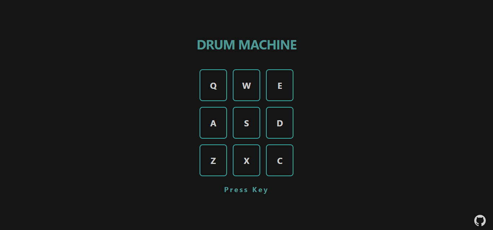

# Drum Machine - FreeCodeCamp Front End Libraries Development



## Table of contents

- [Overview](#overview)
  - [The challenge](#the-challenge)
  - [Screenshot](#screenshot)
  - [Links](#links)
- [My process](#my-process)

  - [Built with](#built-with)
  - [What I learned](#what-i-learned)
  - [Useful resources](#useful-resources)

- [Author](#author)
- [Acknowledgments](#acknowledgments)
- [Development](#development)

## Overview

Third project of Front End Libraries Development by [freeCodeCamp](https://freecodecamp.org) building Drum Machine

### The challenge

Fulfill the below user stories and get all of the tests to pass. Give it your own personal style.

1. I should be able to see an outer container with a corresponding `id="drum-machine"` that contains all other elements.

2. Within `#drum-machine` I can see an element with a corresponding `id="display"`.

3. Within `#drum-machine` I can see 9 clickable drum pad elements, each with a class name of `drum-pad`, a unique id that describes the audio clip the drum pad will be set up to trigger, and an inner text that corresponds to one of the following keys on the keyboard: **Q, W, E, A, S, D, Z, X, C**. The drum pads MUST be in this order.

4. Within each .drum-pad, there should be an HTML5 audio element which has a src attribute pointing to an audio clip, a class name of clip, and an id corresponding to the inner text of its parent `.drum-pad` (e.g. `id="Q"`, `id="W"`, `id="E"` etc.).

5. When I click on a `.drum-pad` element, the audio clip contained in its child audio element should be triggered.

6. When I press the trigger key associated with each `.drum-pad`, the audio clip contained in its child audio element should be triggered (e.g. pressing the Q key should trigger the drum pad which contains the string Q, pressing the W key should trigger the drum pad which contains the string W, etc.).

7. When a `.drum-pad` is triggered, a string describing the associated audio clip is displayed as the inner text of the `#display` element (each string must be unique).

You can build your project by using this CodePen template and clicking Save to create your own pen. Or you can use this CDN link to run the tests in any environment you like: [Test Script](https://cdn.freecodecamp.org/testable-projects-fcc/v1/bundle.js)

### Screenshot


### Links

Live Site URL: [Drum Machine](https://drum-machine-arbase.vercel.app/)

## My process

### Built with

- [React](https://reactjs.org/) - JS library
- [Chakra UI](https://chakra-ui.com/) - Component library

### What I learned

By building this Drum machine using React I learned a lot of React concepts like useState, useEffects, props, keys and list, and how to pass a state to others components.

### Useful resources

- [Pass state to sibling components](https://laurieontech.com/posts/sibling-state/) - This helped me for understanding how to pass state to others components. I really liked this article because this article is well explained.
- [Why do we need keys in React](https://www.youtube.com/watch?v=J_S97E8xjcA&) - This is an amazing video which helped me finally understand why we need keys in React. I'd recommend it to anyone still learning this concept.

## Author

- Website - [Aroyan Bakti](https://www.aroyanbakti.com)
- Twitter - [@aroyanbaktis](https://www.twitter.com/aroyanbaktis)

## Acknowledgments

Thanks to [ReactJS Indonesia Community](https://t.me/react_idn) and [codingfess](https://twitter.com/codingfess) for helped me to answers my questions.

## Development

Clone the repository, install the dependencies and start the application

```
git clone https://github.com/aroyan/drum-machine.git
npm install
npm start
```
